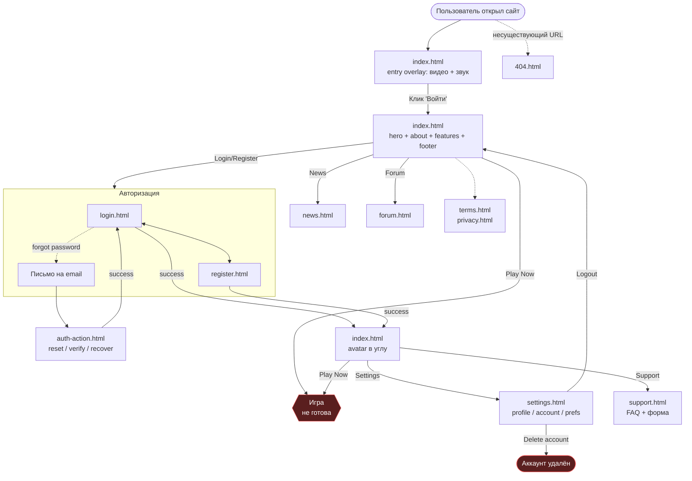
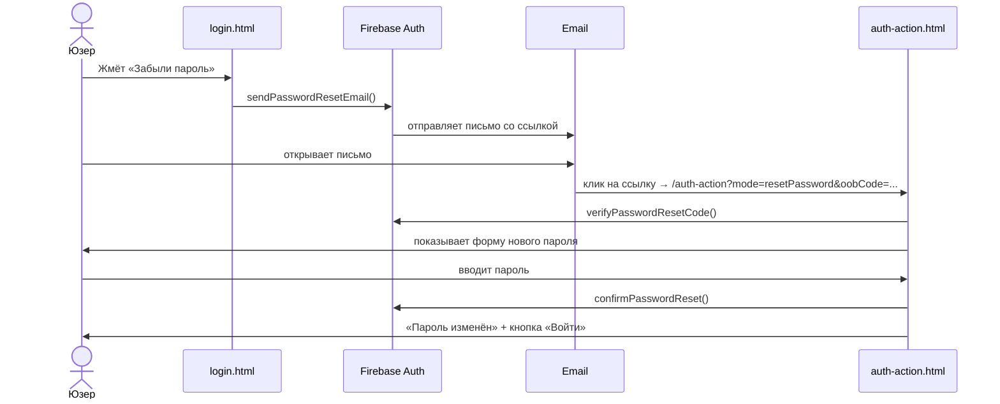

# User Journey Map - Sword Art Online Web

> Внутренний документ. Для юзеров не публикуется.
> Цель: зафиксировать, как реальные люди двигаются по сайту, и где у нас
> «дыры» - тупики, лишние клики, неочевидные шаги.
>
> Статусы шагов:
> - [x] ок, работает как задумано
> - [~] работает, но не идеально (мелкий UX-косяк)
> - [!] сломано / тупик / явная проблема
> - [ ] ещё не реализовано

---

## 1. Общая карта сайта (все роуты)

---

## 2. Персоны и сценарии

У нас **3 ключевые персоны**. Для каждой - свой путь. Статусы ниже показывают,
где сейчас дыры.

### 👤 Новичок («первый раз слышу про этот проект»)

**Цель:** понять, что это, и решить - стоит ли тратить время.

| # | Шаг | Статус | Заметка |
|---|-----|--------|---------|
| 1 | Попадает на `/` из поисковика / ссылки | [x] | ок |
| 2 | Видит entry overlay с видео | [x] | атмосферно, отличный hook |
| 3 | Кликает «Войти в игру» → слышит звук | [x] | ок |
| 4 | Скроллит вниз, читает про мир, фичи | [x] | 6 карточек фич понятные |
| 5 | Жмёт **Play Now** ожидая лендинг игры | [!] | **кнопка не ведёт никуда** |
| 6 | Разочарован, уходит | [!] | юзер потерян без захвата email |

**Что починить:**
- **Play Now** → модалка «Игра скоро, оставь email» + запись в Firestore `waitlist/`.
- В hero дописать микро-строку «Open Beta - 2026» чтобы честно ставить ожидания.

---

### 🔁 Возвращающийся игрок («у меня уже есть аккаунт»)

**Цель:** залогиниться и играть за 2 клика.

| # | Шаг | Статус | Заметка |
|---|-----|--------|---------|
| 1 | Открывает `/` | [x] | ок |
| 2 | Сидит на entry overlay - он ему уже не нужен | [~] | нет «skip forever» галочки |
| 3 | Жмёт Login в nav | [x] | ок |
| 4 | Вводит email+пароль **или** жмёт Google | [x] | ок, оба пути работают |
| 5 | Успех → редирект на главную | [x] | ок |
| 6 | Видит свой аватар в углу | [~] | нет приветствия «С возвращением, {имя}» |
| 7 | Жмёт Play Now → игра | [!] | игры нет - см. выше |

**Что починить:**
- Галочка «не показывать entry overlay» в `localStorage`.
- Toast «С возвращением!» после успешного логина (RU/EN/...).

---

### 💸 Потенциальный донатер

**Цель:** купить что-то внутриигровое / поддержать проект.

| # | Шаг | Статус | Заметка |
|---|-----|--------|---------|
| 1 | Ищет «купить / магазин / donate» в nav | [!] | **раздела нет** |
| 2 | Идёт в FAQ, видит «Оплата / Донаты» | [~] | но это категория тикета, не магазин |
| 3 | Не находит что купить - уходит | [!] | упущенная выручка |

**Что починить:**
- Позже - отдельная страница `shop.html` или модалка `Поддержать проект`.
- Хотя бы статичный лендинг «Donations coming soon» с email-подпиской.

---

### 🐛 Баг-репортёр

**Цель:** сообщить о проблеме, получить ответ.

| # | Шаг | Статус | Заметка |
|---|-----|--------|---------|
| 1 | Идёт в Support | [x] | есть в nav и footer |
| 2 | Читает FAQ, ищет свой вопрос | [x] | 8 Q&A, аккуратный аккордеон |
| 3 | Не находит - листает ниже к форме | [x] | ок |
| 4 | Заполняет поля, выбирает категорию, прикрепляет скрин | [x] | валидация есть |
| 5 | Жмёт «Отправить» | [~] | видит «спасибо» |
| 6 | **Реально никто тикет не получает** | [!] | тикет пишется только в `localStorage` |
| 7 | Юзер ждёт ответа - ответа нет никогда | [!] | доверие пробито |

**Что починить (высший приоритет):**
- Firestore `supportTickets/` - тикеты туда.
- Cloud Function on-create → Discord webhook + email на саппорт-ящик.
- Авто-ответ юзеру на его email «мы получили твой тикет #ID».

---

### 👻 Гость форума («зашёл почитать»)

**Цель:** почитать обсуждения, возможно вписаться.

| # | Шаг | Статус | Заметка |
|---|-----|--------|---------|
| 1 | Открывает Forum | [x] | ок, публичный чтение |
| 2 | Видит категории и недавние треды | [x] | ок, live-данные из Firestore |
| 3 | Кликает тред | [~] | открывается? - проверь, у меня нет уверенности что роутинг тредов готов |
| 4 | Хочет ответить | [!] | **нет inline-CTA «Войди чтобы ответить»** |
| 5 | Идёт в header искать Login | [~] | лишний шаг |
| 6 | После логина возвращается на главную, не на тот тред | [!] | теряет контекст |

**Что починить:**
- Inline CTA в треде: `[Войти чтобы ответить]` → `login.html?returnTo=/forum/thread/ID`.
- Параметр `returnTo` в login + обработка в success-handler.

---

## 3. Вспомогательные пути

### Восстановление пароля

Статус: **[x] работает end-to-end**, протестировано в прошлых сессиях.

### Verify email / Recover email
Работают через тот же `auth-action.html` - другие значения `mode`. [x].

---

## 4. Сводная таблица проблем по приоритетам

| # | Проблема | Сценарий | Сложность | Приоритет |
|---|----------|----------|-----------|-----------|
| 1 | Support-тикеты никуда не уходят | 🐛 Баг-репортёр | средняя (Cloud Function + Discord/Email) | **P0** |
| 2 | Play Now → тупик | 👤 Новичок, 🔁 Возвращающийся | низкая (модалка) | **P0** |
| 3 | Нет магазина/донатов | 💸 Донатер | высокая (отдельная страница + платёжка) | P2 |
| 4 | Нет returnTo в login | 👻 Гость форума | низкая (query-param + redirect) | P1 |
| 5 | Нет приветствия после логина | 🔁 Возвращающийся | низкая (toast) | P1 |
| 6 | Entry overlay нельзя отключить | 🔁 Возвращающийся | низкая (галочка + localStorage) | P1 |
| 7 | Нет breadcrumbs в forum | 👻 Гость форума | средняя (зависит от роутинга тредов) | P2 |
| 8 | Delete account без cooldown | все залогиненные | средняя (backend grace period) | P2 |
| 9 | Нет onboarding для новичка | 👤 Новичок | высокая | P3 |

**P0** - блокер, делать сейчас.
**P1** - мелкие фиксы, заметный эффект, легко.
**P2** - нужны решения, но не горит.
**P3** - nice to have.

---

## 5. Метрики, которые подтвердят, что карта честная

Пока аналитики нет - мы **угадываем**. Когда подключим (Firebase Analytics /
Plausible / умеренный self-host), надо смотреть:

- **Bounce rate** на `index.html` - если >70%, значит hero не цепляет.
- **Click-through** на Play Now - если люди жмут и сразу уходят → проблема #2 подтверждена.
- **Воронка регистрации**: `/register` → submit → success → landing. Где отваливаются?
- **Среднее время ответа на support тикет** - если >24ч, FAQ провалил свою работу.
- **Язык** - какие локали реально используются. Может, 4 из 8 не нужны.

---

## 6. Changelog этого документа

| Дата | Изменение |
|------|-----------|
| 2026-04-19 | Первая версия. Зафиксировано состояние после чистки «anime» контента и replace em-dashes. |
